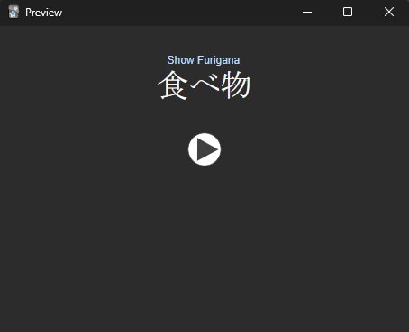
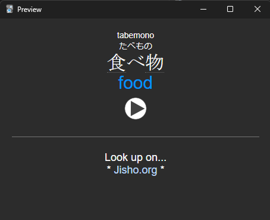

# Japanese Bulk Card Creator

This addon automates creation of bulk Japanese phrase/vocab cards using a bundled JMdictionary, with optional online audio downloads from <a href="https://jisho.org" rel="nofollow">jisho.org</a>.

## Features
<ul>
    <li>Create multiple flashcards at once from just kanji or words</li>
    <li>Works with custom note types by matching fields</li>
    <li>Optionally downloads audio from Jisho, otherwise internet not needed, a Jmdict is bundled</li>
    <li>Configurable Hepburn romanization options</li>
</ul>

### Suported Dictionary Fields
<ul>
    <li>Expression</li>
    <li>Reading</li>
    <li>Romaji</li>
    <li>Glossary Definition</li>
    <li>2nd Glossary Definition (If Available)</li>
    <li>3rd Glossary Definition (If Available)</li>
    <li>Audio</li>
</ul>

### Usage
You need a pre-existing deck and note type with fields. 
In Anki, Press <b>Tools</b> then <b>Japanese Bulk Card Creator</b>  
Select the Deck you want to create cards for, then press Card Format to map your fields. 
Save the Card Format, enter your expressions, then submit.

### Sample Note Type and Card
My personal note type and card is 
<a href="https://github.com/TrumanHarp/Japanese-Bulk-Card-Creator/raw/refs/heads/main/Sample%20Note%20Type.apkg" download>available in this repository.</a> 
Here is what it looks like: 

  
  

